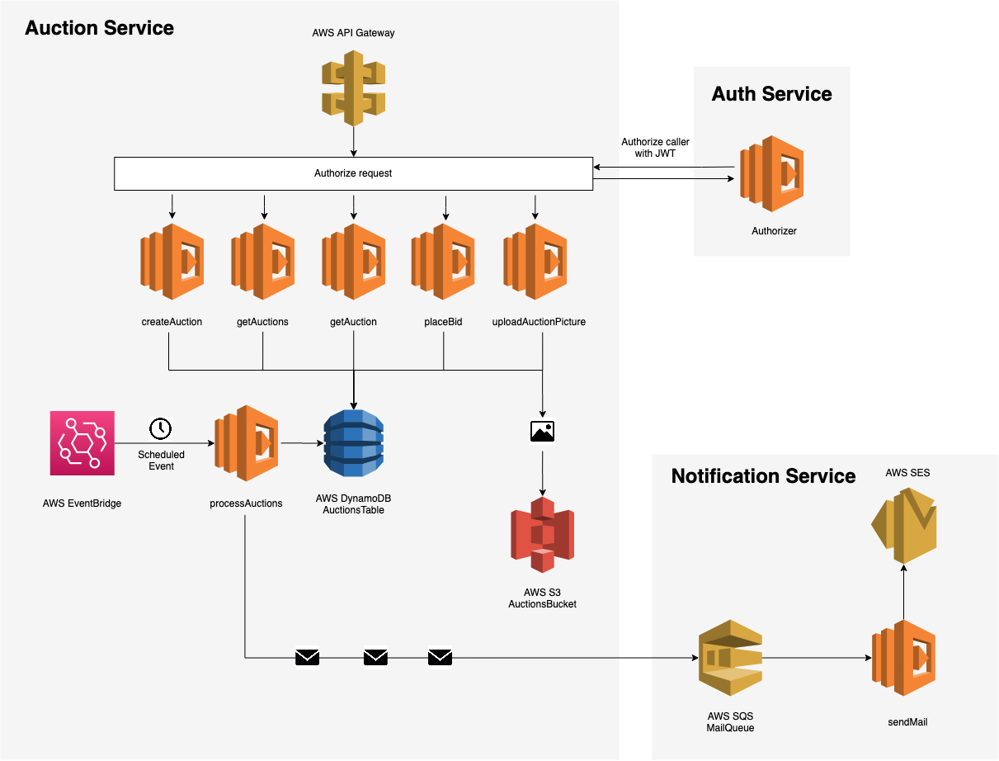

# Serverless auction service

Project developed following the course [Serverless Framework Bootcamp: Node.js, AWS & Microservices](https://www.udemy.com/course/serverless-framework/) by [Ariel Weinberger](https://www.udemy.com/user/ariel-weinberger/)

Aim of the course has been to develop a reliable and scalable Serverless application, following the microservices architecture.

Among the things learned in building this application there is:

- REST API and CRUD endpoints (AWS Lambda, API Gateway)
- Data persistence (AWS DynamoDB)
- Message Queues for cross-service communication (AWS SQS)
- Scheduled event triggers (AWS EventBridge)
- Cloud stack management (AWS CloudFormation)
- Object storage on the cloud (AWS S3)
- Email notifications (AWS SES)
- Middleware
- Authentication and Authorization (Lambda Authorizer)
- Data validation and error handling
